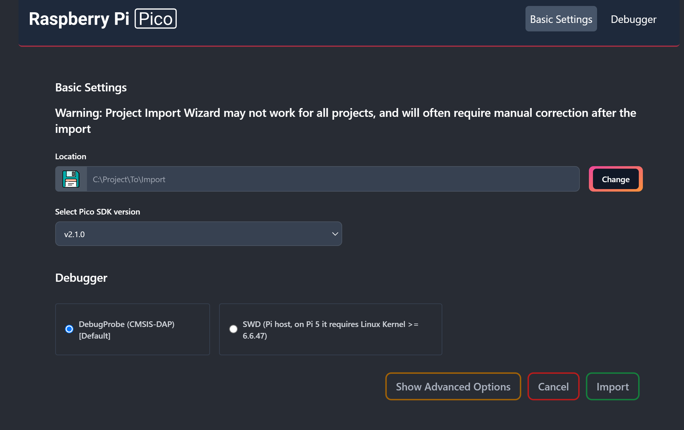
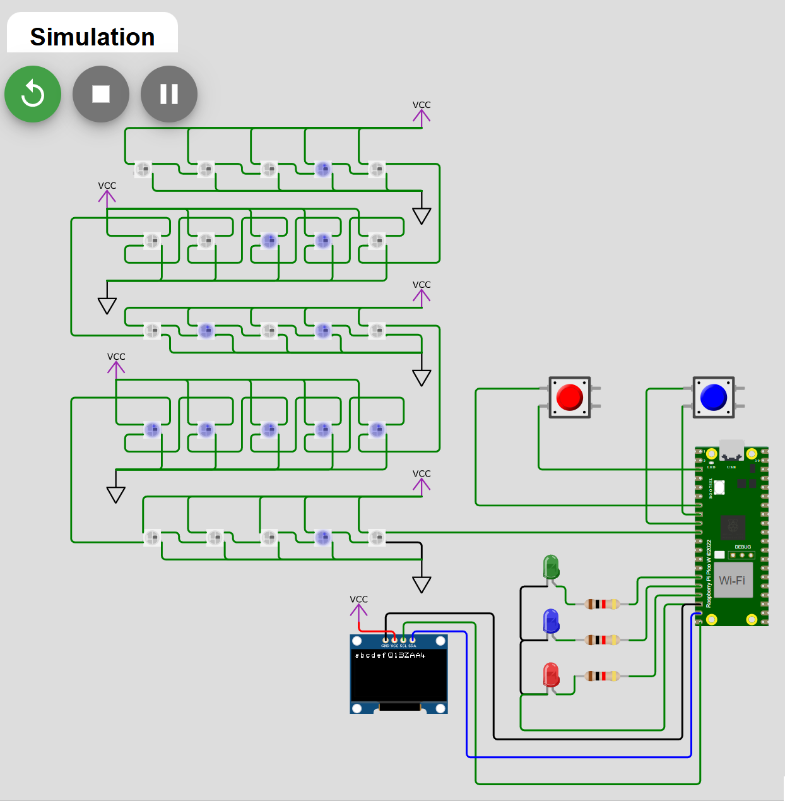
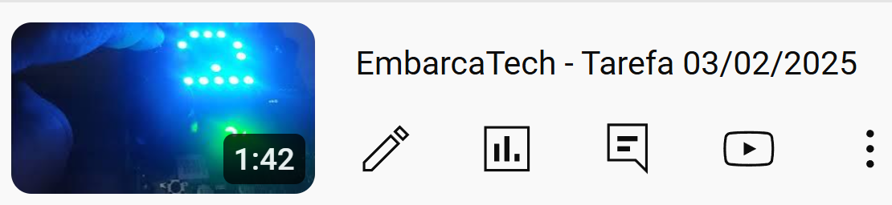

<h1 align="center">Embarcatec | Tarefa Aula Sincrona 03/02/2025</h1>

<div align="center">  
  
</div>

## Objetivo do Projeto

Projeto para Placa Bitdoglab (Raspberry Pico W) exibe na matriz WS2812 e no display SSD1306, números de 0 a 9, e letras maúsculas e minúsculas no display SSD1306 ao enviar caracteres via serial usando o teclado. Além disso, ao clicar o botão A a cor verde do led central é alternada entre liga/desliga e ao quando botão B da placa é acionado a cor azul é alternada entre liga/desliga. Uso do debounce implementado para os botões.


## 🗒️ Lista de requisitos

- Cabo USB
- Placa Bitdoglab ou os itens abaixo:
    - 2 Push buttons;
    - Protoboard;
    - Fios e jumpers; 
    - 3 leds vermelho, verde e azul;
    - 3 Resistores 1kΩ;
    - Display SSD1306;
    - Microcontrolador Raspberry Pi Pico W; 
    - Matriz de LEDs Coloridos (LED-RGB 5x5 WS2812);

## 🛠 Tecnologias

1. **Git e Github**;
2. **VScode**;
3. **Linguagem C**;
4. **Extensões no VScode do Raspberry Pi Pico Project e CMake**

## 💻 Instruções para Importar, Compilar e Rodar o Código Localmente

Siga os passos abaixo para clonar o repositório, importar no VS Code usando a extensão do **Raspberry Pi Pico Project**, compilar e executar o código.

1. **Clone o repositório para sua máquina local**  
   Abra o terminal e execute os comandos abaixo:
   ```bash
   git clone https://github.com/alexsami-lopes/EmbarcaTech-Tarefa2-Aula-Sincrona-03-02-2025.git
   cd EmbarcaTech-Tarefa2-Aula-Sincrona-03-02-2025

2. **Abra o VS Code e instale a extensão "Raspberry Pi Pico Project" (caso não já a tenha instalada)**
 - No VS Code, vá até "Extensões" (Ctrl+Shift+X)
 - Pesquise por "Raspberry Pi Pico Project"
 - Instale a extensão oficial

3. **Importe o projeto no VS Code**
 - No VS Code, na barra lateral do lado esquerdo clique em "Raspberry Pi Pico Project" 
 - No menu que aparecer clique em 
 - Clicando em "Change" escolha a pasta clonada do repositório
 - Escolha a versão do SDK 2.1.0
 - Clique em "Import"


    


4. **Compile o projeto**
 - Com o projeto aberto no VS Code, pressione 
 - Aguarde a finalização do processo de build

5. **Rode o código no Raspberry Pi Pico**
 - Conecte o Raspberry Pi Pico ao PC segurando o botão "BOOTSEL".
 - Arraste e solte o arquivo `.uf2`, localizado dentro da pasta "build" do seu projeto, gerado na unidade USB montada.
 - O código será carregado automaticamente e o Pico será reiniciado.
 - Caso tenha instalado o driver com o Zadig clique em "Run" ao lado do botão 


## 🔧 Funcionalidades Implementadas:

1. Modificação da Biblioteca font.h • Foram adicionados caracteres minúsculos à biblioteca font.h.
2. Entrada de caracteres via PC
• Utilizado o Serial Monitor do VS Code para digitar os caracteres.
• Cada caractere digitado no Serial Monitor exibe no display SSD1306.
Observação: Apenas um caractere será enviado de cada vez.
• Quando um número entre 0 e 9 for digitado, um símbolo correspondente ao número é exibido, também, na matriz 5x5 WS2812.
3. Interação com o Botão A
• Pressionar o botão A alterna o estado do LED RGB Verde (ligado/desligado).
• A operação é registrada de duas formas:
o Uma mensagem informativa sobre o estado do LED é exibida no display SSD1306
o Um texto descritivo sobre a operação é enviado ao Serial Monitor.
4. Interação com o Botão B
• Pressionar o botão A alterna o estado do LED RGB Azul (ligado/desligado).
• A operação é registrada de duas formas:
o Uma mensagem informativa sobre o estado do LED é exibida no display SSD1306
o Um texto descritivo sobre a operação é enviado ao Serial Monitor.

## 💻 Desenvolvedor
 
<table>
  <tr>

<td align="center"><br /><sub><b> Alexsami Lopes </b></sub></a><br />👨‍💻</a></td>

  </tr>
</table>


## 🎥 Demonstração no Wokwi: 

<div align="center">
  <figure>  
    
    
<figcaption>

**Figura 1** - Demo do Projeto no Wokwi.com
    </figcaption>
  </figure>
</div>


## 🎥 Demonstração na Placa (Video): 

<div align="center">
  <a href="https://youtu.be/XNgZfNbbnKY" target="_blank">
    
  </a>
</div>